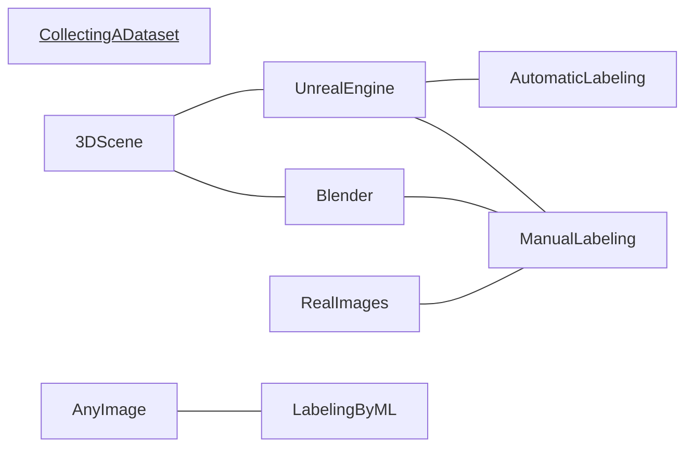
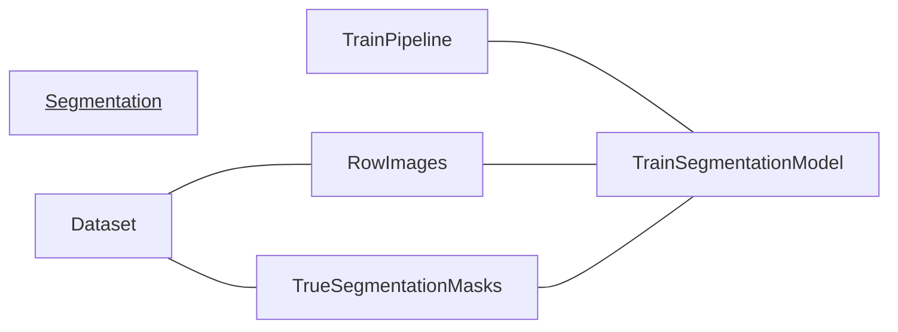
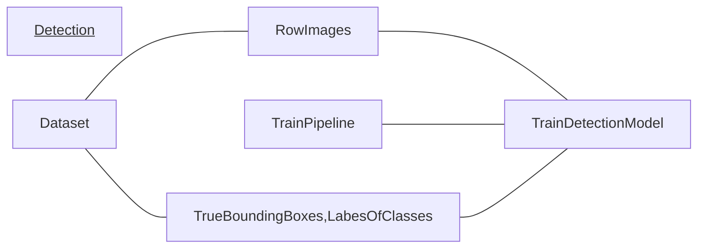
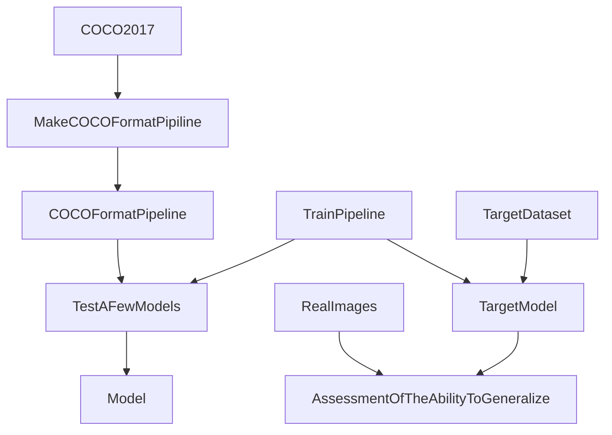
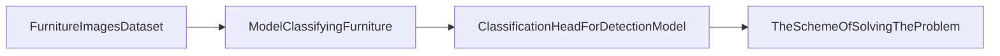
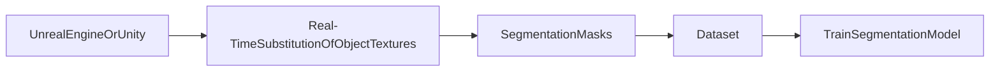
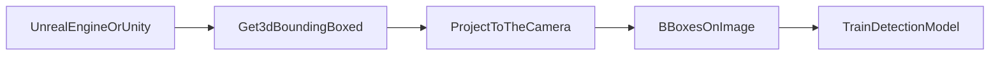
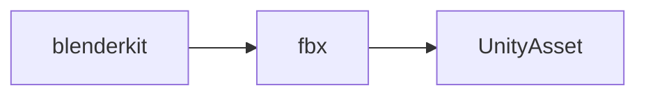

# Metrics 

jacard index  

$$
    JI = \frac{|A B|}{|A + B|}
$$

jacard coefficient

$$
 JC = \frac{|AB|}{|A|+|B|-|AB|}
$$

**detection metrics**  

mAP (mean Average Precision)

$$
    mAP = \frac{1}{n} \sum_{i=1}^{n}{AP_{i}}
$$  

where $AP_{i}$ is the average precision for class $c_{i}$ and $n$ is the number of classes  

AP (Average Precision)  

$$
    AP = \sum_{i=1}^{n}{(R_{i}-R_{i-1})P_{i}} = \int_{0}^{1}{precision(recall)d(recall)}
$$

mAR (mean Average Recall)

# general scheme  

<!--  -->
<!-- graph TD -->
<!-- graph LR -->
<!--  -->

___

___

___

# the scheme of solving the problem

# the scheme of solving the problem with transfer learning  

___ 

# solving the problem with automatic labeling  

# automatic detection of overlapping objects

# creating a dataset  

# list of links
1. [the best introductory lecture](https://www.youtube.com/watch?v=r2KA99ThEH4&list=PL5FkQ0AF9O_o2Eb5Qn8pwCDg7TniyV1Wb&index=7)
2. [object detection tutorial on github](https://github.com/sgrvinod/a-PyTorch-Tutorial-to-Object-Detection/blob/master/README.md)
3. [COCO dataset overview](https://www.youtube.com/watch?v=h6s61a_pqfM)  
4. [MIPT Computer Vision](https://www.youtube.com/watch?v=-lIVq52AAPc&list=PL4_hYwCyhAvZeq93ssEUaR47xhvs7IhJM&index=12)  
5. [ssd300 article](https://arxiv.org/pdf/1512.02325.pdf)
6. [COCO format viewer](https://github.com/trsvchn/coco-viewer)
7. [unreal engine segmentation dataset](https://www.youtube.com/watch?v=FhdKNTcm12w)
8. [scalable object detection using deep neural networks (2013)](https://arxiv.org/pdf/1312.2249.pdf)
9. [3d person camera in unity](https://www.youtube.com/watch?v=owW7BE2t8ME)
10. [segmentation mask in utiny](https://www.youtube.com/watch?v=-4_ucqmAbNk)