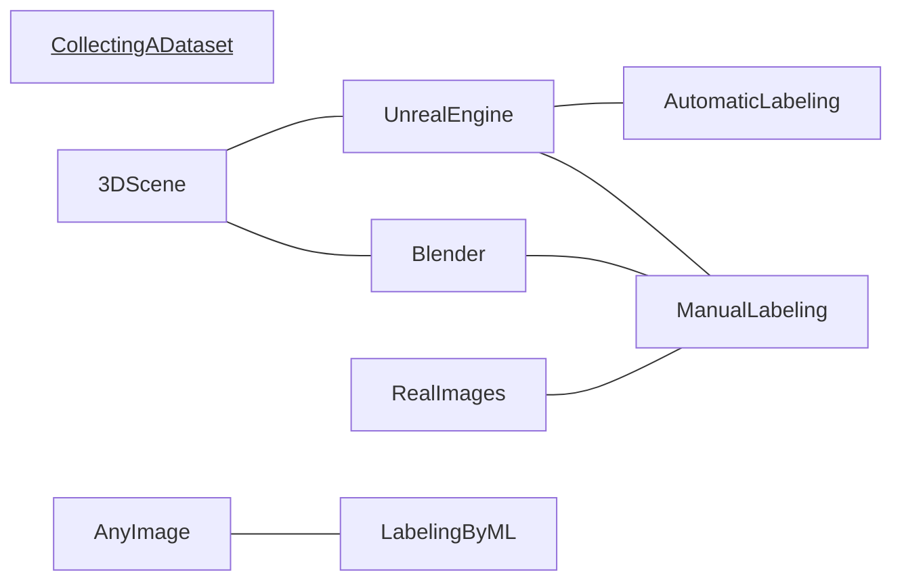
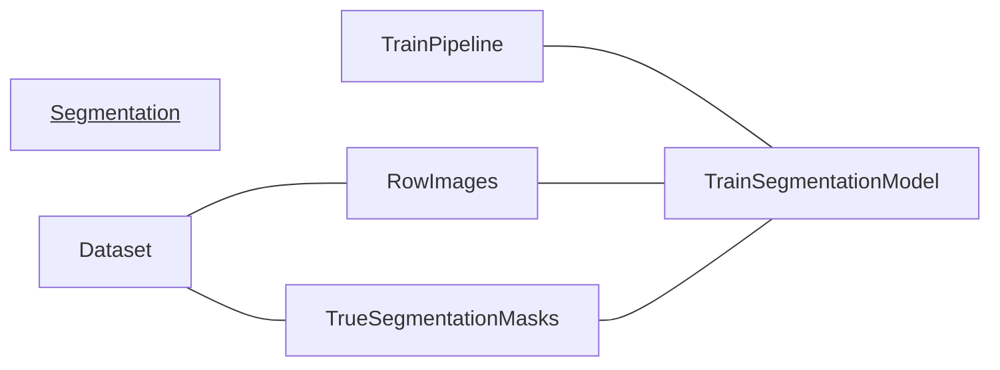
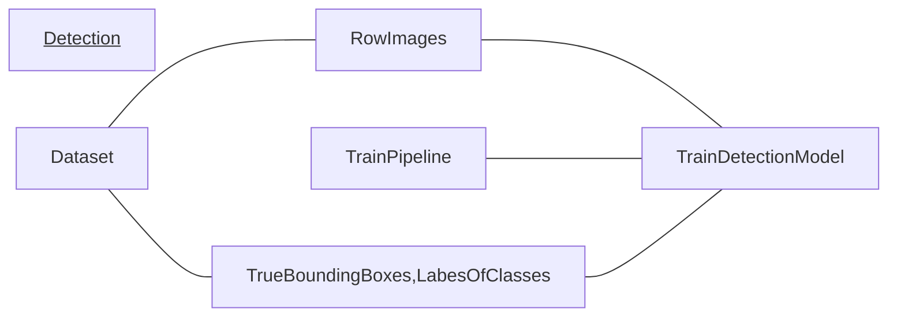
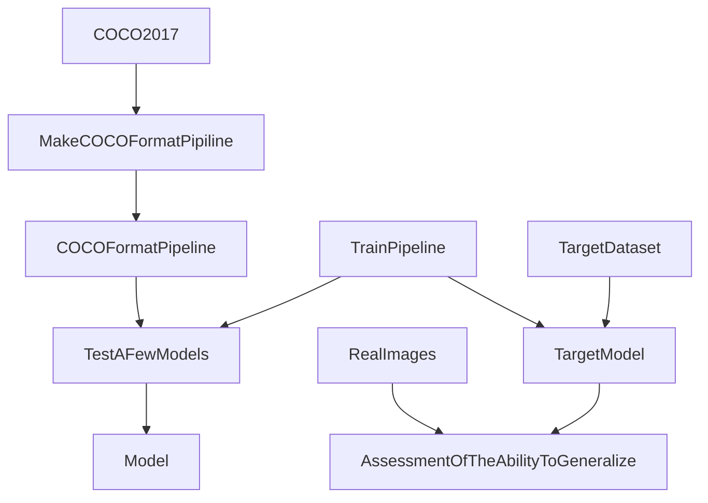
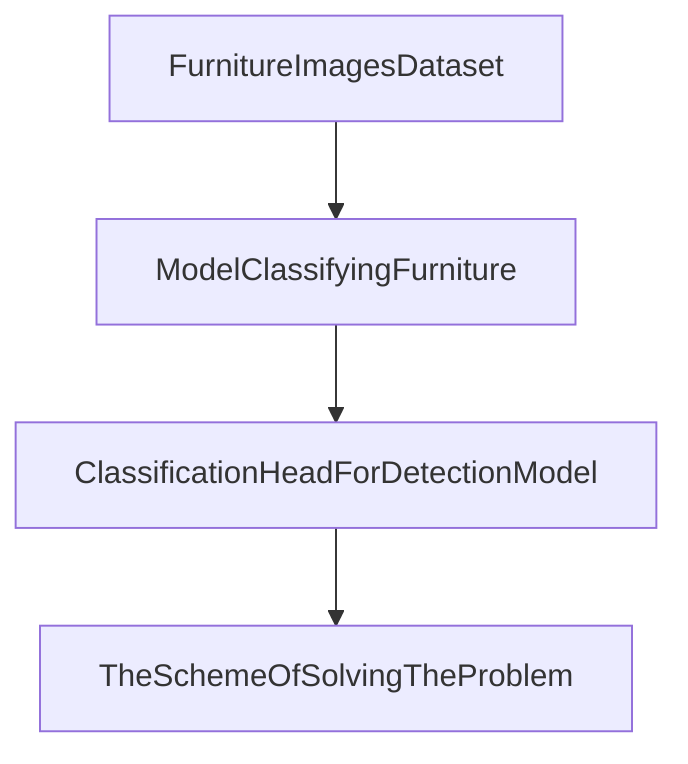
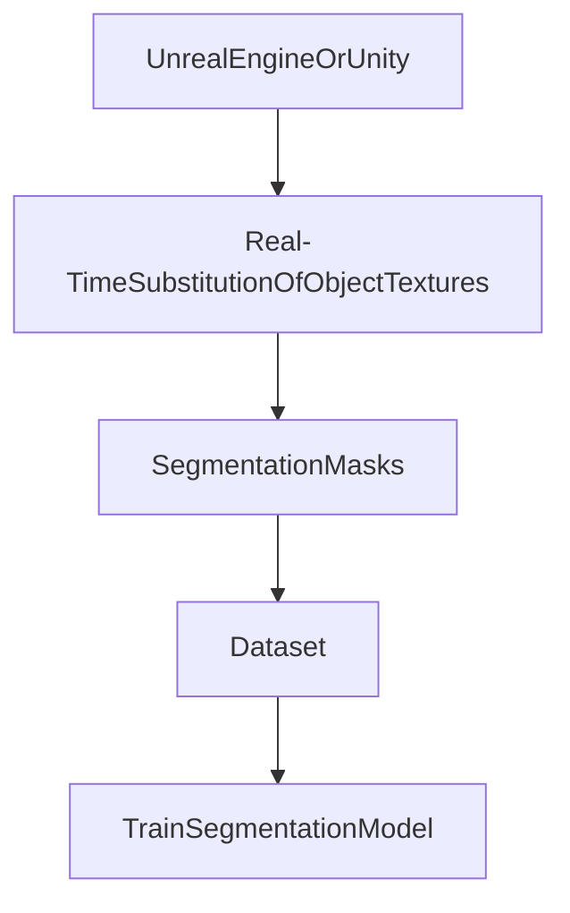
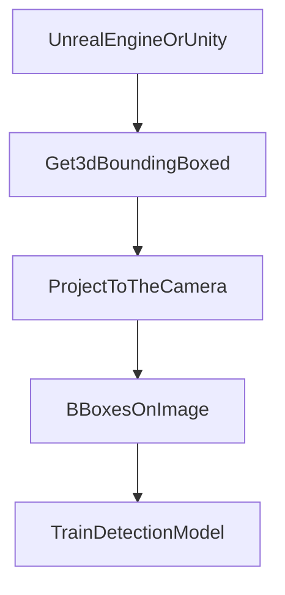

# Metrics 

jacard index (intersection over union)  

$$
    JI =IOU= \frac{|A B|}{|A + B|}
$$

jacard coefficient

$$
 JC = \frac{|AB|}{|A|+|B|-|AB|}
$$

**detection precision and recall**

$TP$: $IOU>\alpha$ and $c_{predicted}=c_{ground \: truth}$ 
$FP$: $IOU<\alpha$ or $c_{predicted} \neq c_{ground \: truth}$
$FN$: $IOU < \alpha$  - the algorithm predict a box either outside the ground truth box of the object, or did not predict a box at all
$TN$: the algorithm correctly did not pay attention to the specified area (box)

$$
    precision = \frac{TP}{TP+FP}
$$
$$
    recall  = \frac{TP}{TP+FN}
$$
$$ 
    F_{\beta} = (1+\beta^{2})\frac{precision \cdot recall}{(\beta^{2} \cdot precision)+recall}
$$

$TP$ - number of hitting the targets
$FN$ - number of skipping targets
$FP$ - number of false alarms  

**detection metrics**  

mAP (mean Average Precision)

$$
    mAP = \frac{1}{n} \sum_{i=1}^{n}{AP_{i}}
$$    

where $AP_{i}$ is the average precision for class $c_{i}$ and $n$ is the number of classes    

For one class:  
AP (Average Precision)   


$$
    AP = \sum_{i=1}^{N-1}{(R_{i+1}-R_{i})P_{i}} = \int_{0}^{1}{precision(recall)d(recall)}
$$  


$N$   - the number of predictions for this class  


$$
    scores = \{s_{1},...,s_{N}\}, s_{i} \geq s_{i+1} \\
    precision_{i}^{*} = precision^{*}(bboxes[1:i],labels[1:i]) \\
    recall_{i}^{*} = recall^{*}(bboxes[1:i],labels[1:i]) \\ 
    precision(recall) = \{(precision_{i}^{*},recall_{i}^{*}),i=\overline{1,N}\} 
$$   


The \(precision^{*}\) is then defined as the number of true positives divided by the number of all detected boxes and the $recall^{*}$ is defined as the number of true positives divided by the number of all ground boxes.


mAR (mean Average Recall)


# non - maximum supperssion  


# general scheme  

<!--  -->
<!-- graph TD -->
<!-- graph LR -->
<!--  -->


___


___



___

# the scheme of solving the problem




# the scheme of solving the problem with transfer learning  


___ 

# solving the problem with automatic labeling  






# automatic detection of overlapping objects


# changing the image registration conditions 


# creating a 3d scene  


# COCO format for detection  

Dataset:  
```json 
{
    "info": {...},
    "licenses": [...],
    "images": [...],
    "annotations": [...],
    "categories": [...]
}
```  
Components:  
```json
"info": {
    "description": "COCO 2017 Dataset",
    "url": "http://cocodataset.org",
    "version": "1.0",
    "year": 2017,
    "contributor": "COCO Consortium",
    "date_created": "2017/09/01"
}
"licenses": [
    {
        "url": "http://creativecommons.org/licenses/by-nc-sa/2.0/",
        "id": 1,
        "name": "Attribution-NonCommercial-ShareAlike License"
    },
    {
        "url": "http://creativecommons.org/licenses/by-nc/2.0/",
        "id": 2,
        "name": "Attribution-NonCommercial License"
    },
    ...
]
"images": [
    {
        "license": 4,
        "file_name": "000000397133.jpg",
        "coco_url": "http://images.cocodataset.org/val2017/000000397133.jpg",
        "height": 427,
        "width": 640,
        "date_captured": "2013-11-14 17:02:52",
        "flickr_url": "http://farm7.staticflickr.com/6116/6255196340_da26cf2c9e_z.jpg",
        "id": 397133
    },
    {
        "license": 1,
        "file_name": "000000037777.jpg",
        "coco_url": "http://images.cocodataset.org/val2017/000000037777.jpg",
        "height": 230,
        "width": 352,
        "date_captured": "2013-11-14 20:55:31",
        "flickr_url": "http://farm9.staticflickr.com/8429/7839199426_f6d48aa585_z.jpg",
        "id": 37777
    },
    ...
]

"categories": [
    {"supercategory": "person","id": 1,"name": "person"},
    {"supercategory": "vehicle","id": 2,"name": "bicycle"},
    {"supercategory": "vehicle","id": 3,"name": "car"},
    {"supercategory": "vehicle","id": 4,"name": "motorcycle"},
    {"supercategory": "vehicle","id": 5,"name": "airplane"},
    ...
    {"supercategory": "indoor","id": 89,"name": "hair drier"},
    {"supercategory": "indoor","id": 90,"name": "toothbrush"}
]

"annotations": [
    {
        "segmentation": [[510.66,423.01,511.72,420.03,...,510.45,423.01]],
        "area": 702.1057499999998,
        "iscrowd": 0,
        "image_id": 289343,
        "bbox": [473.07,395.93,38.65,28.67],
        "category_id": 18,
        "id": 1768
    },
    ...
    {
        "segmentation": {
            "counts": [179,27,392,41,…,55,20],
            "size": [426,640]
        },
        "area": 220834,
        "iscrowd": 1,
        "image_id": 250282,
        "bbox": [0,34,639,388],
        "category_id": 1,
        "id": 900100250282
    }
]

```

# Results  

[link to dataset](https://disk.yandex.ru/d/oaPkIglpbI00CA)

## class distribution 
<!-- https://drive.google.com/file/d/1PHppoAl-wbw_8oo0DCwmzO9EM3lS10Vj/view?usp=drive_link -->


## Values of the loss function during gradient descent  

$$
    \mathcal{L} = \alpha \mathcal{L}_{classification} + \beta \mathcal{L}_{regression} ,\alpha =1,\beta=1
$$

ep - epoch index


<!-- <div id="iframeDiv">
    <iframe src="https://drive.google.com/uc?id=1PvLDLon4oqIJbpUwf-hf9VA5A4Aw-WVy" iframetag style="width:1600px;height:900px;background color:red"></iframe>
</div> -->

<!--  -->

<!-- <p><a href="https://drive.google.com/uc?id=1PvLDLon4oqIJbpUwf-hf9VA5A4Aw-WVy" target="iframe_a">W3Schools.com</a></p>
https://drive.google.com/file/d/1PvLDLon4oqIJbpUwf-hf9VA5A4Aw-WVy/view?usp=drive_link -->

<!-- https://drive.google.com/file/d/1PvLDLon4oqIJbpUwf-hf9VA5A4Aw-WVy/view?usp=sharing -->
<!-- https://drive.google.com/uc?id=1M-86XxdvFWy5j9qLpq9ca6YwteP2R5lX -->
<!-- 
<div w3-include-html="../ds_project_data/train_log/lossfigure.html"></div>
<a href="../ds_project_data/train_log/lossfigure.html" rel="import"> </a> -->


## mAP(train dataset)  
model: SSD300_VGG16

<!-- https://drive.google.com/file/d/1AAGMzuFqTDsyxQOgcIaKXr1VJhXKlluR/view?usp=drive_link -->


| map               | 0.5197 | global mean average precision                                                                           |
|-------------------|--------|---------------------------------------------------------------------------------------------------------|
| map_small         | 0.6083 | mean average precision for small objects                                                                |
| map_medium        | 0.5975 | mean average precision for medium objects                                                               |
| map_large         | 0.6817 | mean average precision for large objects                                                                |
| mar_1             | 0.4407 | mean average recall for 1 detection per image                                                           |
| mar_10            | -1.0   | mean average recall for 10 detections per image                                                         |
| mar_100           | 0.2553 | mean average recall for 100 detections per image                                                        |
| mar_small         | 0.4952 | mean average recall for small objects                                                                   |
| mar_medium        | 0.5443 | mean average recall for medium objects                                                                  |
| mar_large         | 0.5443 | mean average recall for large objects                                                                   |
| map_50            | -1.0   | (-1 if 0.5 not in the list of iou thresholds), mean average precision at IoU=0.50                       |
| map_75            | 0.7025 | (-1 if 0.75 not in the list of iou thresholds), mean average precision at IoU=0.75                      |
| map_per_class     | 0.4645 | (-1 if class metrics are disabled), mean average precision per observed class                           |
| mar_100_per_class | 0.2914 | (-1 if class metrics are disabled), mean average recall for 100 detections per image per observed class |
<!-- 0.5197
0.6083
0.5975
0.6817
0.4407
-1.0
0.2553
0.4952
0.5443
0.5443
-1.0
0.7025
0.4645
0.2914

a 
a
a
a


| map    
| map_small            
| map_medium            
| map_large            
| mar_1        
| mar_10        
| mar_100        
| mar_small            
| mar_medium            
| mar_large            
| map_50        
| map_75        
| map_per_class                
| mar_100_per_class                    


global mean average precision
mean average precision for small objects
mean average precision for medium objects
mean average precision for large objects
mean average recall for 1 detection per image
mean average recall for 10 detections per image
mean average recall for 100 detections per image
mean average recall for small objects
mean average recall for medium objects
mean average recall for large objects
(-1 if 0.5 not in the list of iou thresholds), mean average precision at IoU=0.50
(-1 if 0.75 not in the list of iou thresholds), mean average precision at IoU=0.75
(-1 if class metrics are disabled), mean average precision per observed class
(-1 if class metrics are disabled), mean average recall for 100 detections per image per observed class -->


<!-- 
{'classes': tensor([ 0,  1,  2,  3,  4,  5,  6,  7,  8,  9, 10], dtype=torch.int32),
 'map': tensor(0.5197),
 'map_50': tensor(0.6083),
 'map_75': tensor(0.5975),
 'map_large': tensor(0.6817),
 'map_medium': tensor(0.4407),
 'map_per_class': tensor(-1.),
 'map_small': tensor(0.2553),
 'mar_1': tensor(0.4952),
 'mar_10': tensor(0.5443),
 'mar_100': tensor(0.5443),
 'mar_100_per_class': tensor(-1.),
 'mar_large': tensor(0.7025),
 'mar_medium': tensor(0.4645),
 'mar_small': tensor(0.2914)
 } -->


# list of links
1. [the best introductory lecture](https://www.youtube.com/watch?v=r2KA99ThEH4&list=PL5FkQ0AF9O_o2Eb5Qn8pwCDg7TniyV1Wb&index=7)
2. [object detection tutorial on github](https://github.com/sgrvinod/a-PyTorch-Tutorial-to-Object-Detection/blob/master/README.md)
3. [COCO dataset overview](https://www.youtube.com/watch?v=h6s61a_pqfM)  
4. [MIPT Computer Vision](https://www.youtube.com/watch?v=-lIVq52AAPc&list=PL4_hYwCyhAvZeq93ssEUaR47xhvs7IhJM&index=12)  
5. [ssd300 article](https://arxiv.org/pdf/1512.02325.pdf)
6. [COCO format viewer](https://github.com/trsvchn/coco-viewer)
7. [unreal engine segmentation dataset](https://www.youtube.com/watch?v=FhdKNTcm12w)
8. [scalable object detection using deep neural networks (2013)](https://arxiv.org/pdf/1312.2249.pdf)
9. [3d person camera in unity](https://www.youtube.com/watch?v=owW7BE2t8ME)
10. [segmentation mask in utiny](https://www.youtube.com/watch?v=-4_ucqmAbNk)